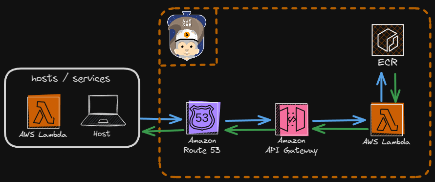

# Prova de Conceito: AWS Lambda com Contêineres

Este projeto serve como uma prova de conceito para explorar a utilização e implementação de funções AWS Lambda com contêineres Docker. O objetivo principal é compreender o funcionamento da execução de funções Lambda em contêineres personalizados, com ênfase em um projeto futuro que pretendo desenvolver, uma vez que as limitações de tamanho das funções Lambda nativas representam um obstáculo para a implementação.

## Fluxo da aplicação
 

## Deploy

Para fazer o deploy, siga os passos abaixo:

1. **Clone o repositório**:
    ```bash
    git clone https://github.com/fabioalmeida08/awsprojects
    cd awsprojects/lambda_with_container 
    ```
2.  **Inicialize o build com o sam**:
    ```bash
    sam build
    ```
3.  **Teste localmente**:
    ```bash
    sam local invoke HelloWorldFunction 
    ```    
4.  **Configure o deploy**:
    ```bash
    sam deploy --guided
    ```
    **OBS: na hora de nomear o projeto de outro nome ou substitua os "_" por "-" no nome sugerido.**
5.  **Limpeza após deploy**:
    ```bash
    sam delete
    docker images # anote o id da imagem que foi criada
    docker rmi <IMAGE_ID>
    ```    
## Notas do que aprendi com o projeto:

- é possível criar e fazer o upload da imagem do contêiner diretamente no ECR utilizando o comando sam deploy --guided, sem precisar configurar um registry no ECR previamente, como é indicado em diversos [tutoriais](https://aws.amazon.com/blogs/compute/using-container-image-support-for-aws-lambda-with-aws-sam/)  que encontrei enquanto pesquisava para executar o projeto.