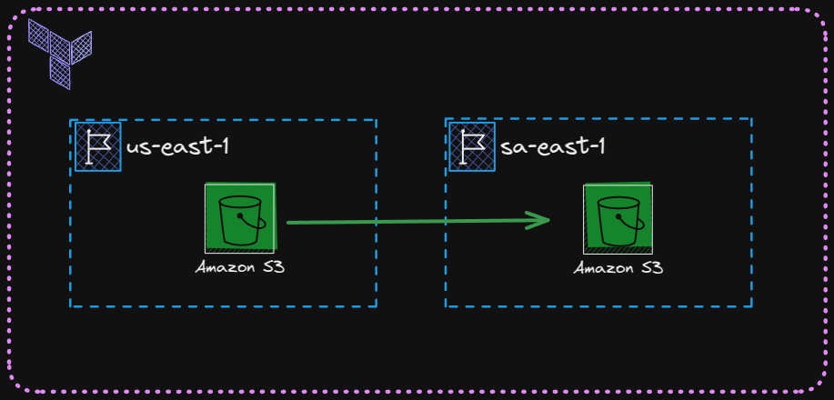

# S3 Cross-Region Replication com Terraform

Este é um projeto simples para demonstrar como configurar a **replicação entre regiões (Cross-Region Replication - CRR)** no Amazon S3 usando o Terraform. O objetivo é replicar automaticamente objetos de um bucket S3 em uma região para outro bucket em uma região diferente.

Abaixo está uma ilustração do projeto:

 

## Notas que aprendi com o projeto:
 - é possivel fazer a replicação a partir de tags especificas ou prefixos dos objetos ou ambos juntos configurando as rules
 - é possivel configurar o terraform para usar 2 providers diferentes no mesmo projeto, no caso de criar o bucket em 2 regiões diferentes