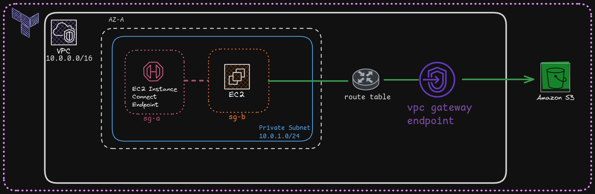

# Projeto: VPC Endpoints na AWS

Este projeto tem como finalidade aplicar os conceitos de **VPC Endpoints** na AWS. Nele, são utilizados dois tipos de endpoints:
1. **EC2 Instance Connect Endpoint**: Para conectar a uma instância EC2 em uma subnet privada sem a necessidade de um bastion host ou IP público.
2. **S3 Endpoint**: Para permitir que a instância privada acesse o Amazon S3 de forma segura e privada, sem atravessar a internet.

Abaixo está uma ilustração do projeto:

 
---

## Requisitos

Antes de começar, certifique-se de ter os seguintes requisitos:

1. **Conta AWS**:
   - Se você ainda não tem uma conta AWS, siga o guia oficial para criar uma: [Como criar uma conta AWS](https://aws.amazon.com/pt/premiumsupport/knowledge-center/create-and-activate-aws-account/).

2. **AWS CLI**:
   - Instale e configure o AWS CLI seguindo a documentação oficial: [Instalar AWS CLI](https://docs.aws.amazon.com/cli/latest/userguide/install-cliv2.html).

3. **Terraform**:
   - Instale o Terraform seguindo o guia oficial: [Instalar Terraform](https://learn.hashicorp.com/tutorials/terraform/install-cli).

---

## Deploy

Para implantar a infraestrutura, siga os passos abaixo:

1. **Clone o repositório**:
    ```bash
    git clone https://github.com/fabioalmeida08/awsprojects
    cd awsprojects/vpc_endpint_project 
    ```
2.  **Inicialize o Terraform**:
    ```bash
    terraform init
    ```

3.  **Planeje a infraestrutura**:
    ```bash
    terraform plan
    ```
4.  **Aplique a infraestrutura**:
    ```bash
    terraform apply
    ```    

### Durante o terraform apply, o Terraform gerará os seguintes outputs:

**Bucket S3**: Nome do bucket S3 criado dinamicamente.

**ID da Instância EC2**: ID da instância EC2 na subnet privada.

Guarde esses valores, pois serão usados na próxima etapa.

## Testar

### 1. Conectar à Instância EC2 usando EC2 Instance Connect Endpoint

Você pode se conectar à instância EC2 de duas maneiras:

#### Via Console AWS:
1. Acesse o **Console da AWS**.
2. Navegue até o serviço **EC2**.
3. Selecione a instância EC2 criada.
4. Clique em **Conectar** e escolha a opção **EC2 Instance Connect Endpoint**.
5. Siga as instruções na tela para se conectar.

#### Via AWS CLI:
Use o comando abaixo para se conectar à instância EC2. Substitua `<instance-id>` pelo ID da instância gerado no output do Terraform.

```bash
aws ec2-instance-connect ssh --instance-id <instance-id>
```

Para mais informações, consulte a documentação oficial: Conectar usando EC2 Instance Connect.

### 2. Criar e Subir um Arquivo no Bucket S3
Dentro da instância EC2, crie um arquivo de texto simples:

```bash
echo "Este é um teste de acesso ao S3 via VPC Endpoint." > teste.txt
```
Use o AWS CLI para subir o arquivo no bucket S3 criado dinamicamente. Substitua <bucket-name> pelo nome do bucket gerado no output do Terraform.

```bash
aws s3 cp teste.txt s3://<bucket-name>/
```
Para verificar se o arquivo foi enviado com sucesso, liste os objetos no bucket:

```bash
aws s3 ls s3://<bucket-name>/teste.txt
```

## Limpeza

Após concluir os testes, é importante destruir a infraestrutura para evitar custos desnecessários na AWS. Para isso, siga os passos abaixo:

1. **Destrua a infraestrutura com Terraform**:
   Execute o comando `terraform destroy` para remover todos os recursos criados:

   ```bash
   terraform destroy
   ```
2. **Confirme a destruição**:
    O Terraform exibirá uma lista de recursos que serão destruídos. Digite yes e pressione Enter para confirmar.

3. **Verifique a remoção**:
    Após a execução, o Terraform removerá todos os recursos, incluindo a instância EC2, o bucket S3 e os VPC Endpoints.

